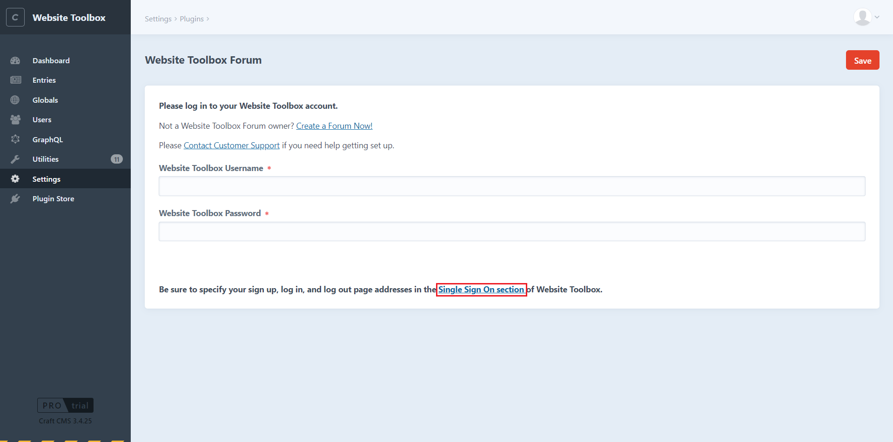

# Website Toolbox Forums plugin for Craft CMS 3.x  

Single Sign On plugin for Craft   

   
 
Related: [Website Toolboxforums for Craft 3.x](https://github.com/webtoolbox/craftcms-plugin)    
 
## Requirements
This plugin requires Craft CMS 3.0.0 or later.   
## Installation
To install Website Toolbox Forum, follow these steps:   
### Install with Composer:
        go to the project directory  
	      1) cd /path/to/my-project.test  
		    tell Composer to load the plugin  
		    Command to execute to install:   
	      2) composer require websitetoolbox/websitetoolboxforum  
		    tell Craft to install the plugin  
	      3) ./craft install/plugin websitetoolbox/websitetoolboxforum                                   
 ### Plugin Store in Craft control panel  
        Go to Dashboard-> Plugin Store-> Search For Website Toolbox Forum-> Click Install.
## Website Toolbox Forum Overview
  Your CraftCMS forum doesn’t need to be basic. Website Toolbox is a cloud-based forum plugin that allows you to easily add a powerful, intuitive, 
  and maintenance-free forum to CraftCMS without slowing it down. No database, servers, or coding required.

## Configuring Website Toolbox Forums
	1)	Go to your Website Toolbox forum Settings. Dashboard-> Settings -> Website Toolbox Forum
	2)	Add Credentials received from Website Toolbox :
				Website Toolbox Username : Your Website Toolbox forum Username
				Website Toolbox Password : Your Website Toolbox forum Password
				Forum Embedded:
					Select option to embedded/non-embedded forum.
   					- Embedded: Forum will be displayed on a website page as a "forum".
   					- Non-embedded: Will create a menu link but will take you to the forum 
							page(https://forumname.discussion.community)
    		
    
	3)	Click on “Single Sign On Section” link. 
			-It will redirect to forum settings page. Please add below details from Craft Website.  

## Forum front-end Templates
### For Embedded Forum:
		Front-End Template Code for Website Toolbox Forums (Embedded Single Sign On (SSO))
		Your Website Toolbox  Forum template can look something like this:
		Add below code to website’s Forum page.
		<body>

</body>
		Exclude <body> tag if it’s already included in template header.

### For Non-Embedded Forum:
		Website Toolbox Forums(Un-Embedded Single Sign On (SSO)).
		Steps to Create menu item:
			1) Go to admin->dashboard->settings->fields->new field
			- Fill the details like name, handle, type  
      (For more details please visit. https://craftcms.com/docs/2.x/fields.html#translatable-fields)
			- Select Field type as "Matrix"
			- In Configuration section:
		   			Add asked details to create menu for forum link:
					Example:
					New block type: Link
					New field:
						1) Name: Menu Name, Field type: Plain Text
						2) Name: Forum Url , Field type: Plain Text
			Save these 2 fields.
			2) Go to admin->dashboard->settings->Globals->New Global Set
				Add Name for global set and in New Global Set->In Field layout add new created field item.
			3) Go to Admin->dashboard->Globals->Select the new global set you created.
				Add you Menu name you want to display and Url for forum (https://forumname.discussion.community).

 
   
